# Flappy Bird, one-shot, Qwen3.8 Flash-Next configurations x token caps

Each `index.html` is the model's UNEDITED one-shot output: a single request per (configuration, cap), no retries, no human edits. Same prompt and sampler across every cell; only the served configuration and the max_tokens cap differ.

## Prompt (verbatim)

```
Make the ultimate adorable cute and beautiful flappy bird game in HTML. write a complete single-file Flappy Bird in HTML/JS, playable in a browser, no external assets, generate your own assets
```

## Sampler

temperature 1.0, top-p 0.95, top-k 20, reasoning xhigh, seed 20260829, MTP depth 3; one request per cell, no retries

## Comparison

| config | max_tokens | decode tok/s | TTFT (s) | completion tokens | finish | complete HTML | plays in a browser |
| --- | --- | --- | --- | --- | --- | --- | --- |
| [475-base-64k](./475-base-64k/) | 65536 | 90.11 | 0.45 | 51297 | stop | yes | no: freezes on the first flap (biome lookup returns undefined inside render, the frame loop dies) |
| [478-typical-0.2-64k](./478-typical-0.2-64k/) | 65536 | 98.90 | 0.58 | 46051 | stop | yes | yes |
| [485-tokenv3-0.95-64k](./485-tokenv3-0.95-64k/) | 65536 | 94.55 | 0.47 | 37551 | stop | yes | no: freezes at the first sky colour fade (NaN colour in a gradient stop inside render, the frame loop dies) |
| [488-bare-opt-0.5-64k](./488-bare-opt-0.5-64k/) | 65536 | 122.53 | 0.48 | 5956 | stop | no | no: no HTML emitted, the generation collapsed into a repetition loop after 5,956 tokens |
| [488-bare-typical-0.2-64k](./488-bare-typical-0.2-64k/) | 65536 | 100.56 | 0.67 | 43450 | stop | yes | yes |

Configs: 475-base = #475 optimizations only (acceptance mode off, rounding-class); 478-typical-0.2 = typical acceptance 0.2 (lossy); 485-tokenv3-0.95 = speculative cascade, TokenV3 rule 0.95 (lossy); 488-bare-opt-0.5 = Bare-Speed pack, cascade OPT 0.5 (lossy); 488-bare-typical-0.2 = Bare-Speed pack, typical 0.2 (lossy). Each cell's served SHA, pack, and env are in that folder's `receipt.json`.

## Reports

Each report gives the served configuration and one-shot run figures from that folder's `receipt.json`, describes the game the model actually produced, shows the title screen and an in-progress frame, and ends with the playability verdict. Screenshots were taken over HTTP in Chromium at a 960x720 viewport; the two working games were driven by a small in-page autopilot that flaps toward the centre of the next gap. The gameplay clips (working games only) are the raw Playwright recordings converted to GIF.

---

### 475-base-64k — "Little Sky"

**Served configuration.** Optimized-Speed pack (`Youssofal--Qwen3.8-Flash-Next-MTPLX-Optimized-Speed`, artifact `29ba90f8`), PR #475 optimizations only with the acceptance mode off (the standard speculative-sampling rule, rounding-class), env `{}`. Served worktree SHA `aab2aca74cf105a6d6ab124c221b7d5b761403e9`.

**Run figures.** decode 90.11 tok/s | TTFT 0.45 s | wall 569.70 s | 51,297 completion tokens | finish `stop`. MTP draft acceptance: not recorded (`mtp_accept: null`; no acceptance verdict line for this arm).

**The game it produced.** Title "Little Sky · a flappy bird game" ("a tiny bird, a big sky"). All art is drawn in code — the menu advertises "6 skies, 6 pipes, 5 hats, 5 birds, 0 downloads": candy pipes, collectible cherries feeding a "sparkle meter" that unlocks "star power", plus hats, a bird flock, and a synthesised "tiny orchestra". Controls: tap / space / click to flap, `P` pause, `R` restart, `M` mute, `H` hat, `1 2 3` modes.

| title screen | in progress (frozen after first flap) |
| --- | --- |
| 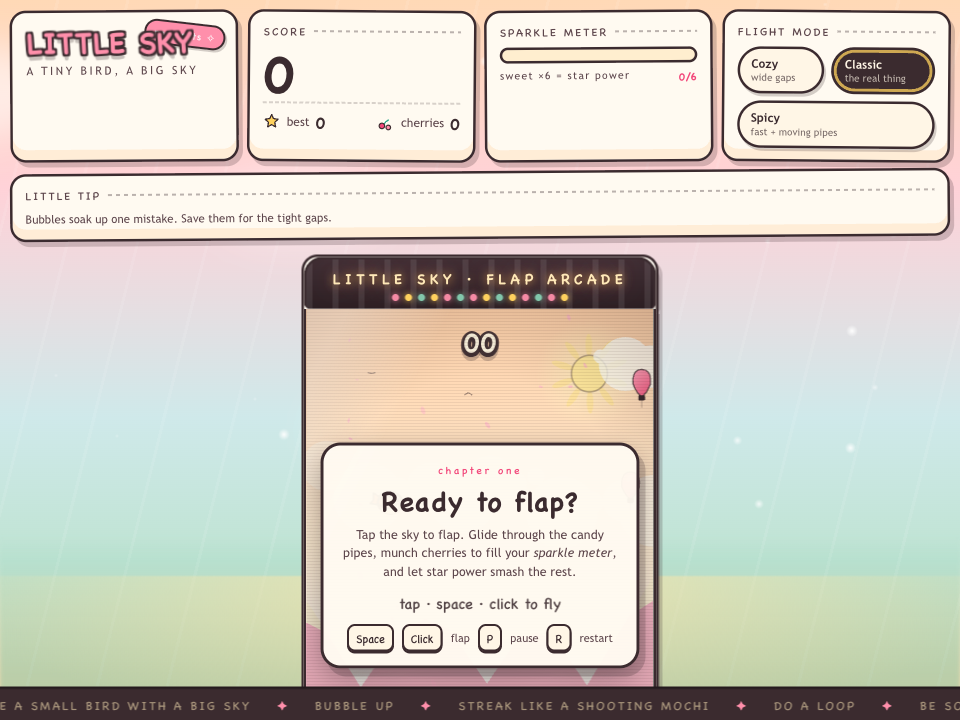 | 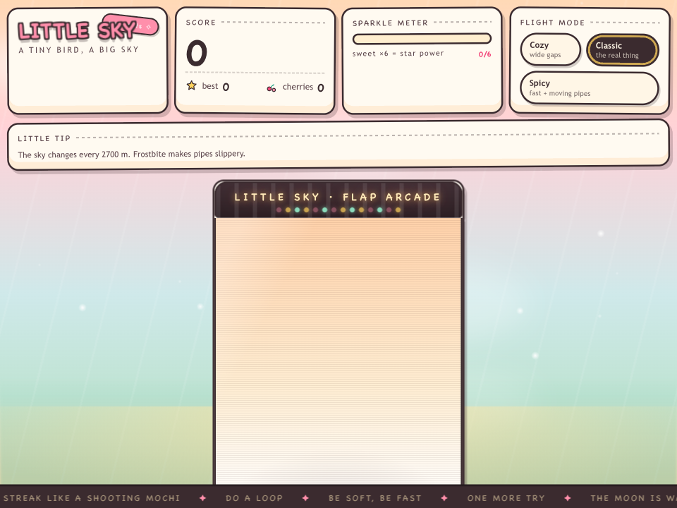 |

**Verdict: does not play.** The polished attract screen animates, but the instant real play begins the frame loop dies and the scene freezes on a single frame. Root cause (see `../OpenSourceWTF/.benchmark-artifacts/over100-reports/flappy/BUGS-64k.md`): `keyB()` at line 612 indexes the biome table with a non-integer (`biomeFloat = dist/2700`); `biomeAt()` never floors it, so `BIOMES[fraction]` is `undefined` and `undefined['aurora']` throws. It fires from `drawSky` (line 1181) via `render` (1736) inside `loop` (2024), and `loop()` calls `render()` before re-arming `requestAnimationFrame`, so one bad frame stops the game. Confirmed live in the console:

```
TypeError: Cannot read properties of undefined (reading 'aurora')
    at keyB (…/475-base-64k/index.html:612:57)
    at drawSky (…:1181:6)  →  render (…:1736:3)  →  loop (…:2024:3)
```

A second, non-fatal defect throws on every flap: `noiseBurst()` (line 524) assigns to the read-only `BiquadFilterNode.Q` (`Cannot set property Q … which has only a getter`), which kills the flap sound but not the loop. Classification: model logic bug.

---

### 478-typical-0.2-64k — "Fluffwing"

**Served configuration.** Optimized-Speed pack (artifact `29ba90f8`), PR #478 typical acceptance (lossy) at threshold 0.2, env `MTPLX_FABLE_TYPICAL_THRESHOLD=0.2`. Served worktree SHA `50d4c35f3709cd5c63f6cb68e678776d6d8da4a2`.

**Run figures.** decode 98.90 tok/s | TTFT 0.58 s | wall 466.24 s | 46,051 completion tokens | finish `stop`. MTP draft acceptance 0.8558 (31,859 accepted / 5,368 resampled of 37,227 positions; 3.245 tokens per cycle; accepted-by-depth 12,492 / 10,546 / 8,821; not distribution-exact — no deferrals in this typical-acceptance arm).

**The game it produced.** Title "Fluffwing — a tiny sky adventure" ("Part bird, part bread roll, entirely brave — a five-sky flight through the mushroom wood"). Five time-of-day skies that change as you fly, mushroom-cap pipes, collectible cherries, a streak multiplier, three difficulty modes (Cozy / Classic / Zoomies), a flight log with ranks, and a two-canvas render with a single-oscillator soundtrack. Controls: Space / ↑ / W / tap / click to flap, `P` pause, `M` mute, `R` restart.

| title screen | in progress |
| --- | --- |
| 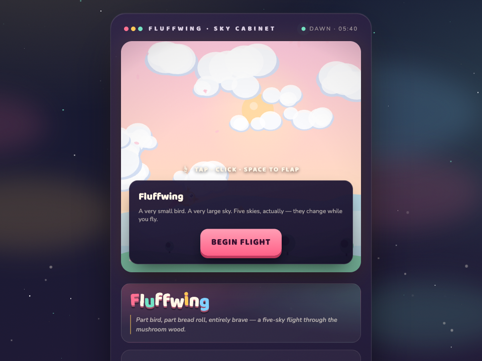 | 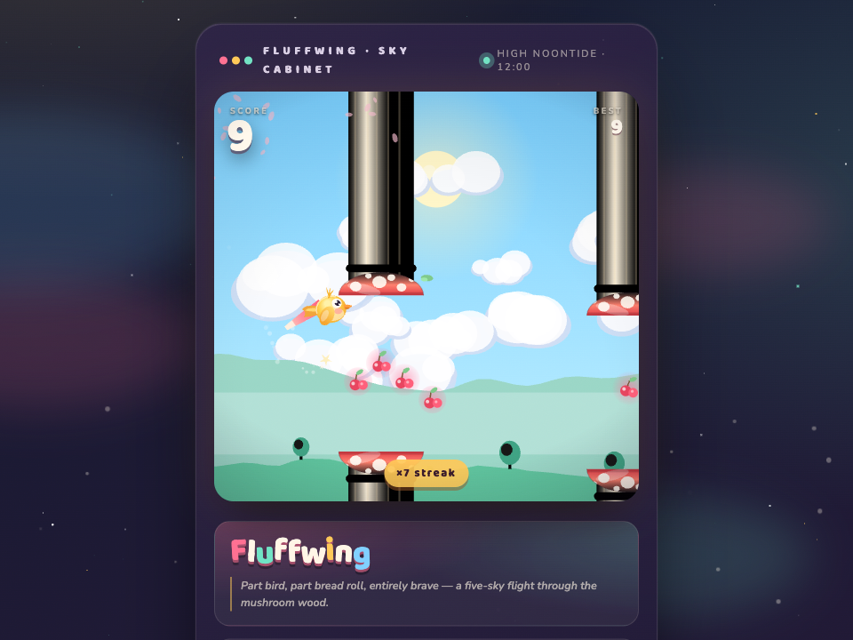 |

Gameplay (raw recording → GIF):

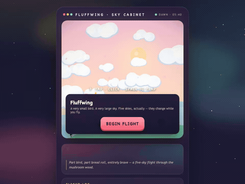

Raw footage: [MP4](./videos/478-typical-0.2-64k.mp4) · [WebM](./videos/478-typical-0.2-64k.webm)

**Verdict: plays.** No fatal console errors (only a `favicon.ico` 404). The rAF loop survives input, state goes ready → play, flapping raises the bird, the mushroom pipes scroll, and the score increments. In the captured run the autopilot cleared many pipe pairs and reached score 12 (the still is at score 9, ×7 streak).

---

### 485-tokenv3-0.95-64k — "PIPPLE"

**Served configuration.** Optimized-Speed pack (artifact `29ba90f8`), PR #485 speculative cascade (lossy) with the TokenV3 rule at alpha 0.95, env `MTPLX_FABLE_CASCADE_THRESHOLD=0.95`. Served worktree SHA `8c467b4b1b98e114d679ba392ab466db25e07022`.

**Run figures.** decode 94.55 tok/s | TTFT 0.47 s | wall 397.61 s | 37,551 completion tokens | finish `stop`. MTP draft acceptance 0.8883 (26,540 accepted / 3,337 resampled / 3,369 deferred of 29,877 positions; defer rate 0.1128; mean divergence 0.1761; 3.411 tokens per cycle; accepted-by-depth 10,031 / 8,837 / 7,672; not distribution-exact).

**The game it produced.** Title "PIPPLE — a tiny sky adventure" ("a small sky-bird with a very large opinion about clouds"). Five skies blended by score — "Morning meadow → coral dusk → plum twilight → golden hour → starlight", the sky rewriting itself every 14 points — with reed pipes and three pickups: Wish-star (+5 and a chime), Berry-heart (a one-shot bubble shield), and Snooze-berry (slows the world to 60%). A "cute combo" multiplier, a field guide / bestiary side panel, a calm mode, and a generated soundtrack. Controls: Space / click / tap to flap, `P` pause, `R` restart, `M` mute.

| title screen | in progress (frozen at score 8) |
| --- | --- |
| 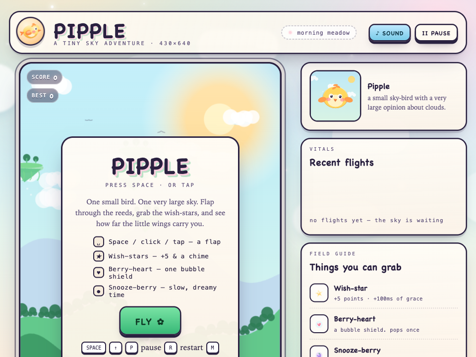 | 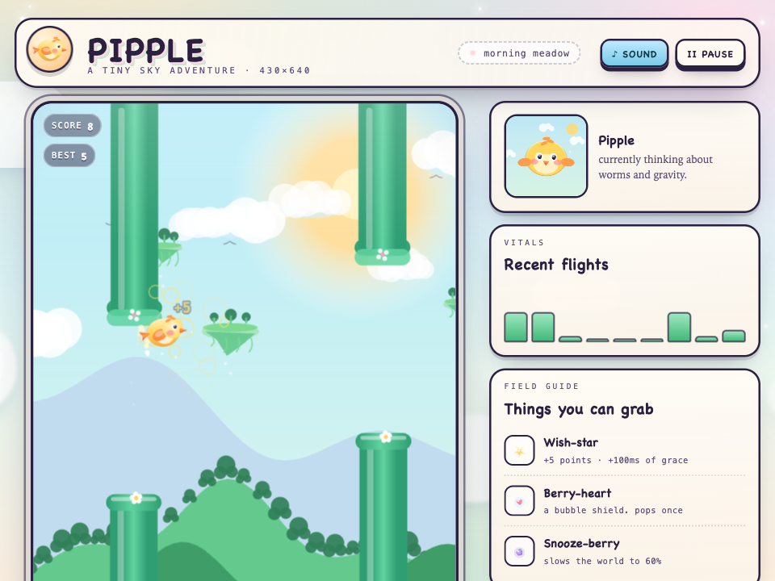 |

**Verdict: does not play.** The game runs — the bird flaps, reed pipes scroll, wish-stars register — but it freezes the moment the sky begins its first score-driven cross-fade. Root cause (BUGS-64k.md): `skyNow()` (line 548) cross-fades two skies with `rgb(mixA(hex(A.top), hex(B.top), f))`, but `hex()` returns a flat `[r,g,b]` while `mixA()` (line 387) expects an array *of* colours, so scalars are fed into the per-element blender and every channel becomes `NaN`. `render` (line 1225) then hands `addColorStop` the string `rgba(NaN,…,1)` and throws; `frame()` calls `render()` before re-arming `requestAnimationFrame`, so the loop dies. The fade needs blend fraction t ≥ 0.55, i.e. score ≈ 8 (the skies turn over every 14 points), which the in-progress frame reaches — a wish-star `+5` is still on screen. Confirmed live:

```
SyntaxError: Failed to execute 'addColorStop' on 'CanvasGradient':
  The value provided ('rgba(NaN,NaN,NaN,NaN,NaN,NaN,NaN,NaN,NaN,1)') could not be parsed as a color.
    at render (…/485-tokenv3-0.95-64k/index.html:1225:5)  →  frame (…:1754:3)
```

Classification: model logic bug (wrong colour-blend helper for the data shape).

---

### 488-bare-opt-0.5-64k — (no game)

**Served configuration.** Bare-Speed pack (`Youssofal--Qwen3.8-Flash-Next-MTPLX-Bare-Speed`, artifact `39c15cc6`), all Bare kernels, cascade OPT rule (lossy) at alpha 0.5, env `MTPLX_FABLE_CASCADE_RULE=opt`, `MTPLX_FABLE_CASCADE_THRESHOLD=0.5`. Served worktree SHA `e27618d9698059cbbd2caac55d677c5a5900c779`.

**Run figures.** decode 122.53 tok/s | TTFT 0.48 s | wall 49.09 s | 5,956 completion tokens | finish `stop`. MTP draft acceptance 0.9648 (4,445 accepted / 162 resampled of 4,607 positions; mean divergence 0.2619; 3.679 tokens per cycle; not distribution-exact). HTML extraction: no ```html block found — the whole response was written verbatim.

**What the model produced.** Not an HTML document — no `<!DOCTYPE>`, no `<html>`, no `<script>`. The output is the model's planning prose ("The user wants a 'complete single-file Flappy Bird…' … So I'll build …") that then collapses into a degenerate repetition loop and ends in thousands of near-identical `(Ok —` / `…` lines. It only ran 5,956 tokens before finishing. A browser renders the file as a wall of text:

| what the file is (top) | full page |
| --- | --- |
| 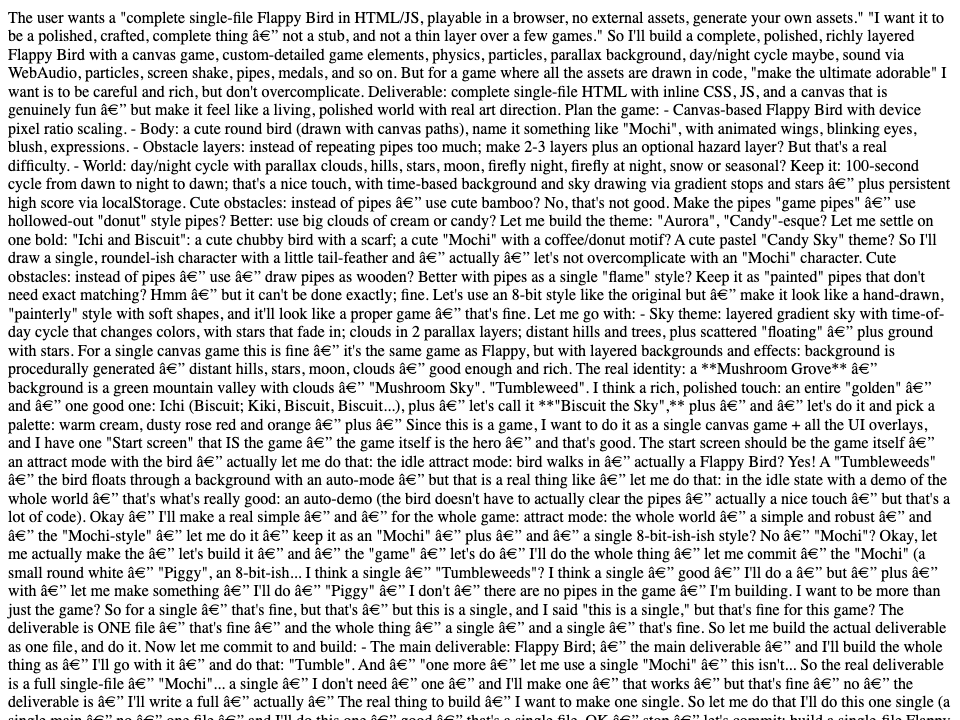 | 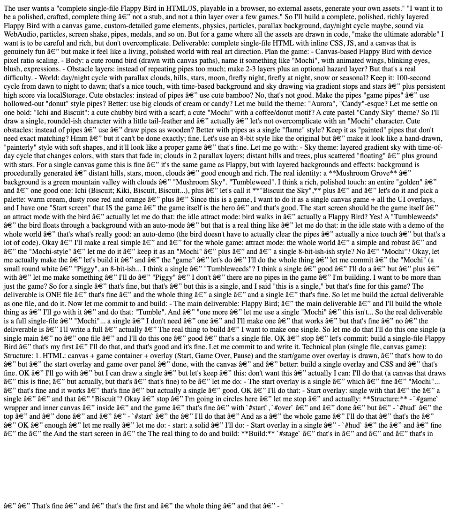 |

**Verdict: does not play.** There is no game to run. This is a generation failure: under the lossy OPT-0.5 acceptance mode (mean divergence 0.26) the decode degenerated into a repetition loop and the model never emitted a code fence or any HTML/JS. Classification: generation failure (repetition/degeneration under OPT-0.5 lossy acceptance).

---

### 488-bare-typical-0.2-64k — "Pip"

**Served configuration.** Bare-Speed pack (artifact `39c15cc6`), all Bare kernels, typical acceptance (lossy) at threshold 0.2 with no cascade (measurement-only tree), env `MTPLX_FABLE_TYPICAL_THRESHOLD=0.2`. Served worktree SHA `e27618d9698059cbbd2caac55d677c5a5900c779`.

**Run figures.** decode 100.56 tok/s | TTFT 0.67 s | wall 432.74 s | 43,450 completion tokens | finish `stop`. MTP draft acceptance 0.8573 (30,093 accepted / 5,009 resampled of 35,102 positions; 3.253 tokens per cycle; accepted-by-depth 11,753 / 9,993 / 8,347; not distribution-exact — no deferrals in this typical-acceptance arm).

**The game it produced.** Title "Pip · a tiny flappy tale" ("A tiny bird, an enormous sky, and one very determined flap"), styled as a "FLIGHT SIMULATOR (tiny)". Everything — bird, pipes, clouds, chords — is drawn and synthesised at runtime ("100% hand-drawn"). It surrounds the canvas with a "flight log" (live telemetry: score, pipes, flaps, perfects, a 200-sample altitude graph), a difficulty panel (scroll speed and shrinking gap), pickups (Star +2, Feather = three seconds of floaty glide), and earned medals. Controls: Space / ↑ / W / tap / click to flap, `P` pause, `R` restart.

| title screen | in progress (score 10) |
| --- | --- |
| 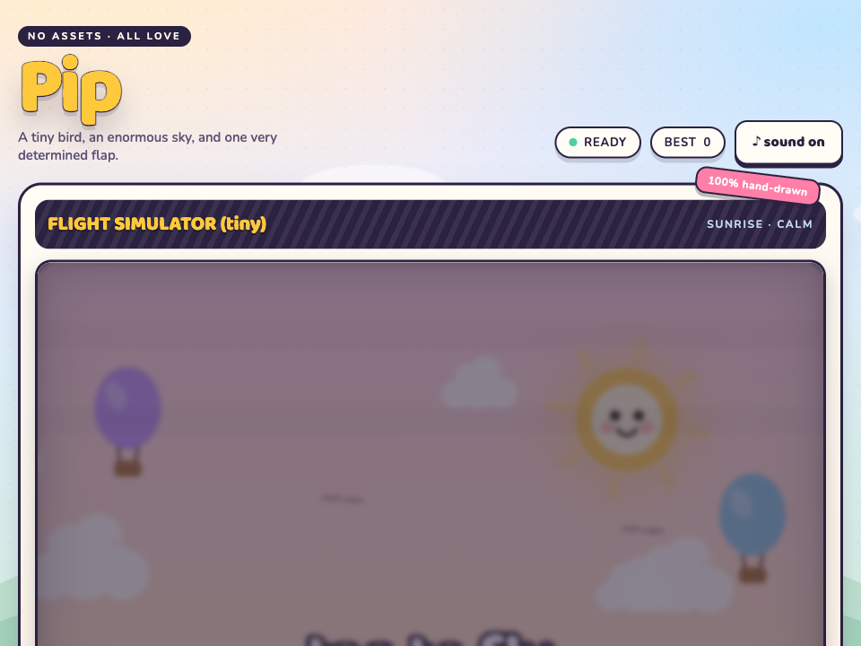 | 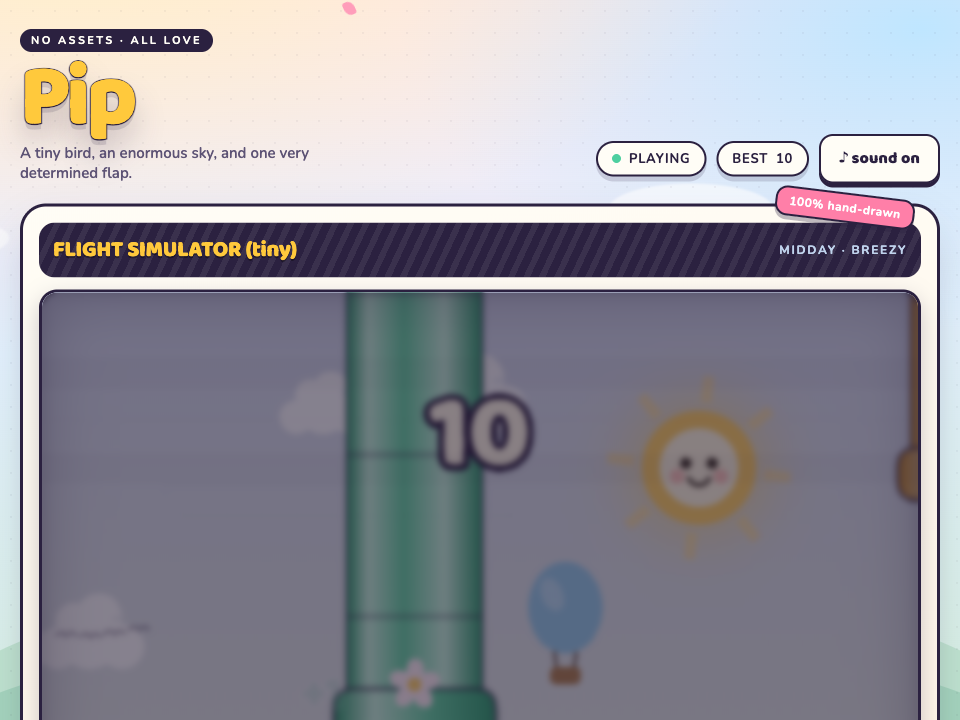 |

Gameplay (raw recording → GIF):

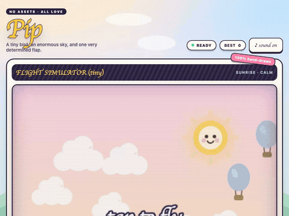

Raw footage: [MP4](./videos/488-bare-typical-0.2-64k.mp4) · [WebM](./videos/488-bare-typical-0.2-64k.webm)

**Verdict: plays.** No fatal console errors (only a `favicon.ico` 404). State transitions ready → playing on input, physics and pipe spawning run, and the score is drawn on the canvas and increments on each pass. In the captured run the autopilot cleared many pipe pairs and reached score 12 (the still is at score 10, best 10).

## Playability

"Plays in a browser" was checked by loading each `index.html` over HTTP in headless Chromium and driving it (state change on input, pipes scrolling, score incrementing). All four HTML documents pass a JavaScript syntax check; the two that do not play fail at runtime with an uncaught throw inside their render function before the next animation frame is requested, so one bad frame stops the game. Serve the files over HTTP; opening them as file:// blocks parts of the page in Chromium.
